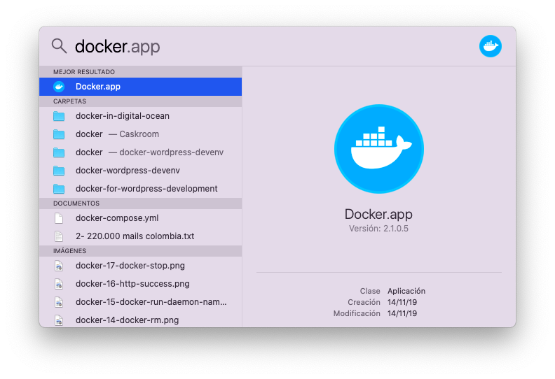
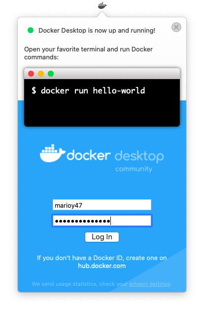
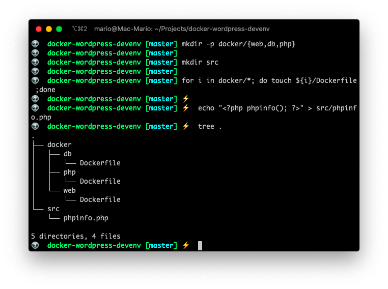

# Using Docker for Wordpress Development

I've been using [Vagrant](https://www.vagrantup.com/) for WordPress development for the las 4 years, and the process has always been the same:

1. Install Vagrant and [Virtualbox](https://www.virtualbox.org/) on my computer
2. Create a new `Vagrantfile` on an empty directory with the commands requried to create a virtual machine.
3. Start vagrant with `vagrant up`.

After I execute those commands I end up with a complete virtual machine with a full fledged linux running inside it. Which is fine, if it wasn't for the fact that:

- The configuration of the `Vagrantfile` is extremely long because you not only have to specify wich OS you need inside your virtual machine, but the steps required to configure that OS in order to have a development environment,
- You have to install a bunch of binaries (trough an script or manually) INSIDE that virtual machine. Apps like a web server, a database engine, a php interpreter, etc.
- You have an **machine** with its own OS inside your machine (that also has an OS). And that consumes resources.
- Make both OSs talk to each other is not a easy task. So when you need to access logs for example, you have to issue commands that you probably shouldn't need to issue.

And to top it all... If I want to deploy Wordpress from my development machine to a production server, I have to follow an strict list of camands and checks to ensure that all versions and all paths on the production machine match the versions and paths of the development one.

So I wanted something faster, less error prone and more resource efficient for that process. That's why I wanted to give [Docker](https://www.docker.com/) a try.

Here I'm going to show you the steps I followed to have a full Wordpress production and development environment using Docker.

## Install and run Docker

The first step was to install Docker.

And if you have Mac OS it couldn't be easier. Just use _brew_ and that's it.

```bash
brew cask install docker
```

Now that Docker is installed, you just need to start it.




If all went well you should have a Docker icon on the **menu bar**. That means that the Docker daemon is alive and well.



## How Docker works

If you've used Vagrant or plain Virtual Box you know that you have to create a virtual machine, in this virtual machine install an OS (Linux most of the time) and of top of all, install the binaries you need like `nginx`, `php` and `mariadb`.

And here is the BIG DIFFERENCE!.

Docker is going to use MY PC's OS kernel to execute the supporting binaries that I need to have a WordPress environment even though they are compiled for another OS. Docker will take care of converting Linux system calls to Mac OS system calls.

... Let me say that in another way. I'll be instructing Docker which Linux binaries to install to run Wordpress directly in my Mac, instead of using a Virtualized PC with its own OS.

That's a big gain...  But also a big change...

The gain is that you don't need a Virtual Machine and in that virtual machine a complete OS.

The change is that you have to create a configuration file for each binary you need to install. So, instead of having one configuration file for the hole development environment, you need to create a configuration file for `php`, `nginx` and `mariadb`.

Ok now... This is not completelly true. There are ways to have just 1 configuration file for all 3 services, or even run them in one big group, but we're trying to be very basic here.

## Configure the Workdir for your development environment

To start then, we need to create a Workdir. And inside that workdir we'll use sub-dirs to configure Nginx, MariaDB, PHP-FPM, etc.

```bash
mkdir -p docker/{web,db,php}
mkdir src
echo '<?php phpinfo(); ?>' > public/index.php
tree docker public
```



- `docker/web/` will contain all the configuration needed for PHP
- `docker/db/` will contain the MariaDB files
- `docker/php/` will contain the php-fpm configuration
- `src/` will contain our WordPress


## Dockerfile para la base de datos

```docker
FROM mariadb:latest

CMD ["mysqld"]

EXPOSE 3306

```

Prueba: `docker build --tag mariadb_phpdev .`


## Dockerfile para nginx

```docker
FROM nginx:alpine

CMD ["nginx"]

EXPOSE 80 443
```

## Dockerfile para php-fpm

```docker
FROM php:fpm-alpine

CMD ["php-fpm"]

EXPOSE 9000
```

> https://x-team.com/blog/docker-compose-php-environment-from-scratch/
