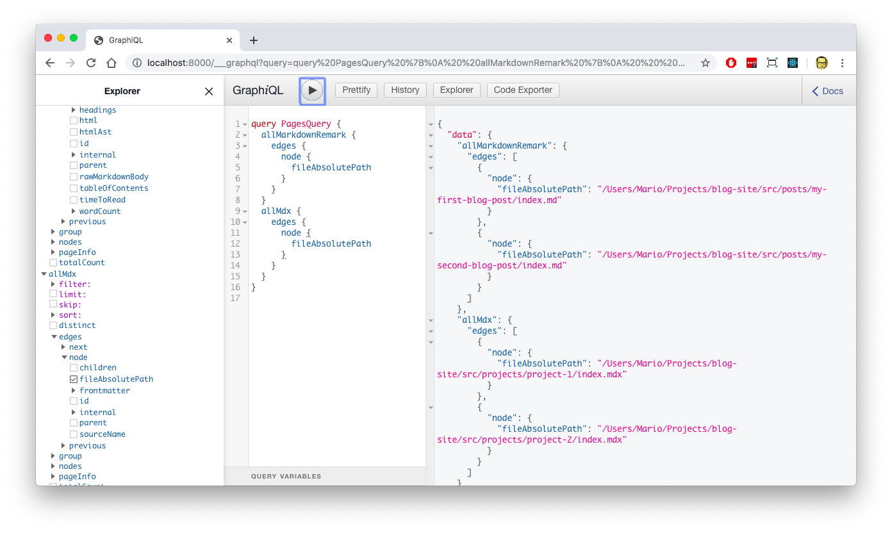

# Create a Developer Portfolio Site (with a blog) with Gatsby

Creating a [Gatsby](https://gatsbyjs.org) site is not an easy task even though the creators of it say it is.

It requires you to be familiar with a bunch of technologies like [graphql](https://developer.facebook.com/graphql), [React](https://reactjs.org), [Markdown](https://jamstack.org), [mdx](https://mdxjs.com), etc. And then you need to research and test a bunch of plugins to get a minimal site up and running.

But after you pass the configuration steps and you have your site set up, you'll have the more performant site you'll ever create. So the advantages compensate the drawbacks.

Here I'll list the steps I took to create my personal blog/portfolio site without going too much into detail since Gatsby already has a [great tutorial](https://gastbyjs.org/tutorial) and the [docs](https://gastbyjs.org/docs) are exceptional.

## Create the site itself

This part is actually easy since its just executing a couple of commands

```bash
mkdir blog-site
cd blog-site
npx gatsby new .
code --install-extension esbenp.prettier-vscode # Only if you use VS Code.
npm start
```

If you know a little about Gatsby, notice that I didn't provided an starter theme. That means that I'm using the **default starter theme**

If you want to build an take a peek at what will be deployed, then issue the `build` command and open a local http server:

```shell
npm run build
cd build
python -m SimpleHTTPServer 9000
```

## Configure the blog metadata to make it more SEO friendly

Edit `gatsby-config.js` file and change the metadata. Basically change:

- The `siteMetadata.title`
- The `siteMetadata.description`
- The `gatsby-plugin-manifest` so it works as a PWA
  - Add a `name`
  - Add a `shortname`

```js
module.exports = {
  plugins: [
    //...
    {
      resolve: `gatsby-plugin-manifest`,
      options: {
        name: `mario-yepes-portfolio`,
        short_name: `portfolio`,
        start_url: `/`,
        background_color: `#f50057`,
        theme_color: `#f50057`,
        display: `minimal-ui`,
        icon: `src/images/svg/icon-developer-round.svg` // This path is relative to the root of the site.
      }
    }
  ]
};
```

## Install plugins

I could start writing JSX files with content for my site right away, but I want to add some features that will make it more performant and make my life easier as a writer. So I'll be installing

- A plugin to write styles using `SCSS`
- A plugin the embeds `SVG` files instead of referencing them
- A plugin to convert `markdown` into `html` so I can write my posts as `.md` files
- A plugin to make the images in the markdown posts more performant and SEO friendly
- A plugin that allows me to use jxs inside markdown files.

### SASS Plugin

I'm going to use SASS instead of CSS to style the site.

For that I'll need to install my first Gatsby extension: `gatsby-plugin-sass`, but for that extension to work, I need to install also `node-sass`.

To install both, I issue the command:

```bash
npm install --save gastby-plugin-sass node-sass
```

Also, I'm going to use the `Fira Sans` font from google fonts, and for that, I need another extension: `gatsby-plugin-google-fonts`. So I need to execute this in the terminal.

```bash
npm install --save gatsby-plugin-google-fonts
```

And in `gasby-config.js` add the following in the `plugins` section:

```js
module.exports = {
  plugins: [
    // ...
    `gatsby-plugin-sass`,
    {
      resolve: `gatsby-plugin-google-fonts`,
      options: {
        fonts: [`Fira Sans\:300, 400,700`],
        display: "swap"
      }
    }
  ]
};
```

Now, I'm also going to use some Bootstrap's mixins, so I need to install that too:

```bash
npm install --save boostrap
```

And I'll replace the content of `src/components/layout.scss` with

```scss
@import "~bootstrap/scss/functions.scss";
@import "~bootstrap/scss/variables.scss";
@import "~bootstrap/scss/mixins.scss";
@import "~bootstrap/scss/reboot.scss";
@import "~bootstrap/scss/type.scss";

html {
  font-size: 18px;
}
```

That will give me access to all the Boostrap mixins, reset the browser styles and also change the default font size.

> Note: this is not the complete styling. This just shows the parts of bootstrap that I'll be using.

### SVG embed plugin

The _gatsby-default-starter_ comes with `gastsby-images-sharp` plugin installed by default, which is great since it helps you to compress and manage images in a very SEO friendly way.

One thing that `gatsby-plugin-sharp` doesn't manage is the inclusion of SVG images inside your content. It only manages `.jpg` and `.png`.

So, I'm going to use a new plugin that does just that... _include svg images inside the content_:

```bash
npm install --save gatsby-plugin-react-svg
```

And in `gastby-config.js` I have to add the follogin in the `plugins` section:

```js
module.exports = {
  plugins: [
    // ...
    {
      resolve: "gatsby-plugin-react-svg",
      options: {
        rule: {
          include: /images\/svg\/.*svg$/
        }
      }
    }
  ]
};
```

This way, every time I `import` an SVG file in a component, Gatsby will include the code of the SVG instead of referencing it using ``.

### Remark plugin

JSX is pretty easy to use since is very similar to html, and if you are just adding content, its not far fetched to use it as the format for writing copy.

... Still

I prefer markdown since is much more easier to write, and most of all, it doesn't have "syntax errors" (it does, but they are kind of hard to make).

So, I'll install markdown support for Gatsby by issuing the following command:

```bash
npm install --save gatsby-transformer-remark
```

An in `gastby-config.js` in the plugins section I'll add

```js
module.exports = {
  plugins: [
    {
      resolve: `gatsby-transformer-remark`,
      options: {
        plugins: []
      }
    }
  ]
};
```

Notice that I left _an empty array_ as the value for `plugins` in the configuration.

The reason for that is that I'll be needing to configure additional Gastby plugins that extends the markdown one.

> Note: This plugin requires some configuration in the `gatsby-node.js` file. See the section about creating pages programmatically below

### Add images to Markdown files plugin

The Gatsby's `gatsby-transformer-remark` plugin, converts markdown files to html very efficiently. But it doesn't take care of the images. Specially local images that the `sharp` plugin has compressed and make more seo friendly.

So I'll be using the `gatsby-remark-images` **remark** plugin to insert images in the blog posts.

```shell
npm install --save gatsby-remark-images
```

This is one of the more cool Gatsby plugins out there. Not only insert images in markdown, but it compresses them and creates SVG equivalents for placeholder content. Also takes care of lazy loading and a bunch of cool stuff.

Take a look at the documentation [here](https://github.com/gatsbyjs/gatsby/tree/master/packages/gatsby-remark-images) so you get a better idea of what you are getting here.

With the plugins installed, lets configure it in the empty array we left in the previous step. That means that we have to edit `gatsby-config.js` agian:

```js
module.exports = {
  plugins: [
    //...
    {
      resolve: `gatsby-transformer-remark`,
      options: {
        plugins: [
          {
            resolve: `gatsby-remark-images`,
            options: {
              linkImagesToOriginal: false,
              maxWidth: 1000,
              withWebp: true
            }
          }
        ]
      }
    }
  ]
};
```

A short explanation of what I did here is:

- Use `gatsby-remark-images` when processing markdown files
- If an image is found that is more than `1024px` wide, then resize it
- Disable auto linking images to the original one
- Make a copy of the image in `webp` to make it even more performant

### Adding Code Highlighting plugin

My site will be a developing site, that means that I'll be creating articles that will have source code inside it. So I'll need a plugin that converts source code snippets into something beautiful to see.

The `prismjs` plugin does just that. Converts code snippets into colored content. Also I'll need a nice theme for that highlighting.

The command to install the prism plugin and a series of highlighting themes is:

```bash
npm install --save gatsby-remark-prismjs prismjs prism-themes
```

And again, lets do some configuration in `gatsby-config.js` by adding the following options INSIDE the options `gatsby-transformer-remark`

```js
module.exports = {
  // ...
  plugins: [
    // ...
    {
      resolve: `gatsby-transformer-remark`,
      options: {
        plugins: [
          {
            resolve: `gatsby-remark-images`,
            options: {
              linkImagesToOriginal: false,
              maxWidth: 1000,
              withWebp: true
            }
          },
          {
            resolve: `gatsby-remark-prismjs`,
            aliases: {
              zsh: "bash"
            }
          }
        ]
      }
    }
  ]
};
```

This `Prismjs` plugin requires css files to colorize the code. So we also need to modify the `gatsby-browser.js` file to include this css.

We just need to add the following 3 lines to the file

```js
require("prism-themes/themes/prism-material-oceanic.css");
require("prismjs/plugins/line-numbers/prism-line-numbers.css");
require("prismjs/plugins/command-line/prism-command-line.css");
```

### Add MDX support plugin

The most used mdx plugin in Gatsby is `gatsby-mdx` which allows you to write your page files using [mdx](https://mdxjs.com/) instead for `jsx`. But that is not what I need for this portfolio site.

For this site what I want is to write the portfolio files in mdx and have the nodes be created programatically. So I'll be needing a transformer plugin instead.

Fortunately there is [`gatsby-transformer-mdx`](https://github.com/karolis-sh/gatsby-mdx/tree/master/packages/gatsby-transformer-mdx) that allows me to query `mdx` files and create pages programmatically.

So I need to install it:

```bash
npm install --save gatsby-transformer-mdx
```

And configure it in `gatsby-config.js` inside the plugins array

```js
module.exports = {
  // ...
  plugins: [
    // ...
    `gatsby-transformer-mdx`
  ]
};
```

> Note: This plugin requires some configuration in the `gatsby-node.js` file. See the section about creating pages programmatically below

!!! We're done!!!... (with the configuration). Now lets start with the development itself.

## Creating pages programmatically

So I've finished the configuration. Its time to extend the Gatsby functionality by adding function on the `gatsby-node.js` to create pages programatically.

But before I create pages programmatically, I have to decide where I'm going to put the blog posts files, which I'll write in `markdown`. And where to put the portfolio pages, which I'll write in `mdx`.

... So:

- The blog posts will reside en `src/posts`. And I'll list them in the `src/pages/blog.js` page.
- The portfolio pages will reside in `src/projects`. And I'll list them in the `src/pages/portfolio.js`

Just for testing. I created 2 blog posts and 2 project "pages" in `src/posts` and `src/projects` respectevly:

```bash
$ tree src/

src
├── components
│   ├── layout.js
│   └── seo.js
├── pages
│   ├── blog.js
│   ├── index.js
│   └── portfolio.js
├── posts
│   ├── this-is-my-first-blog-post
│   │   ├── index.md
│   │   └── joshua-rawson-harris-NSPPhHIJtkA-unsplash.jpg
│   └── this-is-my-second-blog-post
│       └── index.md
├── projects
│   ├── project-1
│   │   └── index.mdx
│   └── project-2
│       └── index.mdx
└── styles
    └── layout.scss
```

Now I have to make the files in `src/posts/*` be visible and accessible via a **slug**. The same goes for the files in `src/projects/*`, the have to be visible and accessible via a _slug_.

### Create slugs for posts and portfolio

if I use `GraphIQL` I can see that both `md` and `mdx` files are accessible:



So lets edit `gastby-node.js` and add the function `onCreateNode` asking Gatsby to add the **slug** field for those 2 type of nodes.

```js
const { createFilePath } = require(`gatsby-source-filesystem`);
const path = require("path");

// Add fields to nodes.
exports.onCreateNode = ({ node, getNode, actions }) => {
  // Add the slug field to the MarkdownRemark nodes.
  if (node.internal.type === `MarkdownRemark`) {
    const relPath = createFilePath({ node, getNode });
    actions.createNodeField({
      node,
      name: `slug`,
      value: relPath.replace("/posts/", "/blog/")
    });
  }

  // Add the slug field to the Mdx nodes.
  if (node.internal.type === `Mdx`) {
    const relPath = createFilePath({ node, getNode });
    actions.createNodeField({
      node,
      name: `slug`,
      value: relPath.replace("/projects/", "/portfolio/")
    });
  }
};
```

Done... Now if I query the site again I'll see those 2 nodes:


### Create the list pages

As I said before. I want the list of blog posts to be in `blog.js` and the list of projects in the `portfolio.js` file.

So lest modify the `blog.js` page to list the blogs:

```jsx
import React from "react"
import { Link, graphql } from "gatsby"

import Layout from "../components/layout"
import SEO from "../components/seo"

const BlogPage = ({ data }) => {
  return (
    <Layout>
      <SEO title="Some notes and articles" />
      <h1>Blog</h1>
      {data.posts.edges.map(({ node }) => (
        <div className="entry">
          <header>
            <Link to={node.fields.slug}> <!-- here is the slug -->
              <h2 className="entry-title" itemProp="headline">
                {node.frontmatter.title}
              </h2>
            </Link>
            <time itemprop="datePublished" datetime={node.frontmatter.date}>
              {node.frontmatter.date}
            </time>
          </header>
        </div>
      ))}
    </Layout>
  )
}

export const query = graphql`
  {
    posts: allMarkdownRemark(
      sort: { fields: frontmatter___date, order: DESC }
      filter: { fileAbsolutePath: { regex: "/src/posts/.+md$/" } }
    ) {
      edges {
        node {
          fields {
            slug
          }
          frontmatter {
            title
            tags
            date(formatString: "YYYY-MM-DD")
          }
        }
      }
    }
  }
`

export default BlogPage
```

> Note: Is really important that each `md` blog file, has a **frontmatter** with the `date` field. Other wise the post's ordering will be thrown off.

And now for the `portfolio.js` page:

```jsx
import React from "react";
import { Link, graphql } from "gatsby";

import Layout from "../components/layout";
import SEO from "../components/seo";

const PortfolioPage = ({ data }) => {
  return (
    <Layout>
      <SEO title="Portfolio" />
      <h1>This are some of the projects I've worked on</h1>
      {data.allMdx.edges.map(({ node }) => (
        <div className="project">
          <div className="image">Image</div>
          <div className="content">
            <h2>{node.frontmatter.title}</h2>
            <div className="desc">{node.frontmatter.desc}</div>
            <div className="tags">{node.frontmatter.tags}</div>
            <div className="read-more">
              <Link to={node.fields.slug}>Read More</Link>
            </div>
          </div>
        </div>
      ))}
    </Layout>
  );
};

export const query = graphql`
  {
    allMdx {
      edges {
        node {
          id
          fileAbsolutePath
          frontmatter {
            title
            image
            desc
          }
          fields {
            slug
          }
        }
      }
    }
  }
`;

export default PortfolioPage;
```

> Note: Is really important that each `mdx` portfolio file, has a **frontmatter** with the `date`, `image`, `tags` and `desc` field. Other wise the project's ordering will be thrown off.

## Create the pages

On the last step I created the slugs, and a couple of pages to list them. The only thing left to do, is to create the pages itself and have them respond the the slugs I created.

For that I have to edit the `gastby-node.js` file **again**, adding the function `createPage` for the actual page creation:

```js
// ....

// Create pages programatically.
exports.createPages = async ({ graphql, actions }) => {
  // Query Remark (md) and Mdx files
  const result = await graphql(`
    query PagesQuery {
      posts: allMarkdownRemark {
        edges {
          node {
            fields {
              slug
            }
          }
        }
      }
      projects: allMdx {
        edges {
          node {
            id
            fileAbsolutePath
            fields {
              slug
            }
          }
        }
      }
    }
  `);

  // Crate pages from markdown.
  result.data.posts.edges.forEach(({ node }) => {
    actions.createPage({
      path: node.fields.slug,
      component: path.resolve("./src/components/posts-template.js"),
      context: {
        slug: node.fields.slug
      }
    });
  });

  // Create pages from mdx.
  result.data.projects.edges.forEach(({ node }) => {
    actions.createPage({
      path: node.fields.slug,
      component: node.fileAbsolutePath,
      context: {
        slug: node.fields.slug,
        id: node.id
      }
    });
  });
};
```

3 Things to notice here:

1. When creating a page programmatically you have to specify a `component` which is a template for the type of content.
2. For the projects, the `component` its the `mdx` file itself.
3. For blogs, I have to create a template.. Which is exactly what I did.

Here is the template (`src/components/blog-template.js`) for the blog posts:

```js
import React from "react";
import { graphql } from "gatsby";
import Layout from "./layout";

const PostsTemplate = ({ data }) => {
  return (
    <Layout>
      <h1>{data.post.frontmatter.title}</h1>
      <article dangerouslySetInnerHTML={{ __html: data.post.html }} />
    </Layout>
  );
};

export const query = graphql`
  query($slug: String!) {
    post: markdownRemark(fields: { slug: { eq: $slug } }) {
      html
      frontmatter {
        title
      }
    }
  }
`;

export default PostsTemplate;
```

Now, when I visit a url like `localhost:8000/portfolio/project-1` or `localhost:8000/blog/my-first-blog-post/` I actually get a page with its content.

!!! WERE DONE!!!! (with the Gatsby development)... Now its time to add content and styling

## Content and styling

The idea is to re-create this design, but in Gatsby:

<iframe style="border: none;" width="800" height="450" src="https://www.figma.com/embed?embed_host=share&url=https%3A%2F%2Fwww.figma.com%2Fproto%2FoJdpUnjYDAjZVTRiwQSttp%2FMarioYepes%3Fnode-id%3D2%253A27%26scaling%3Dmin-zoom" allowfullscreen></iframe>

Here are the steps to follow:

- Create the about page (`about.js`)
- Complete the `blog.js` and `portfolio.js` content so they can be styled
- Add SASS styling to match the colors and placement of content in `layout.scss`
- Publish

Since this steps are not Gatsby related. I'll finish this post here.

Thanks for going this far!
