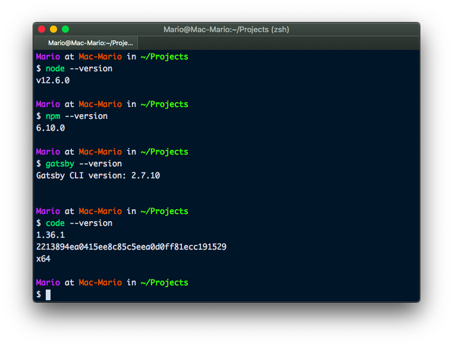
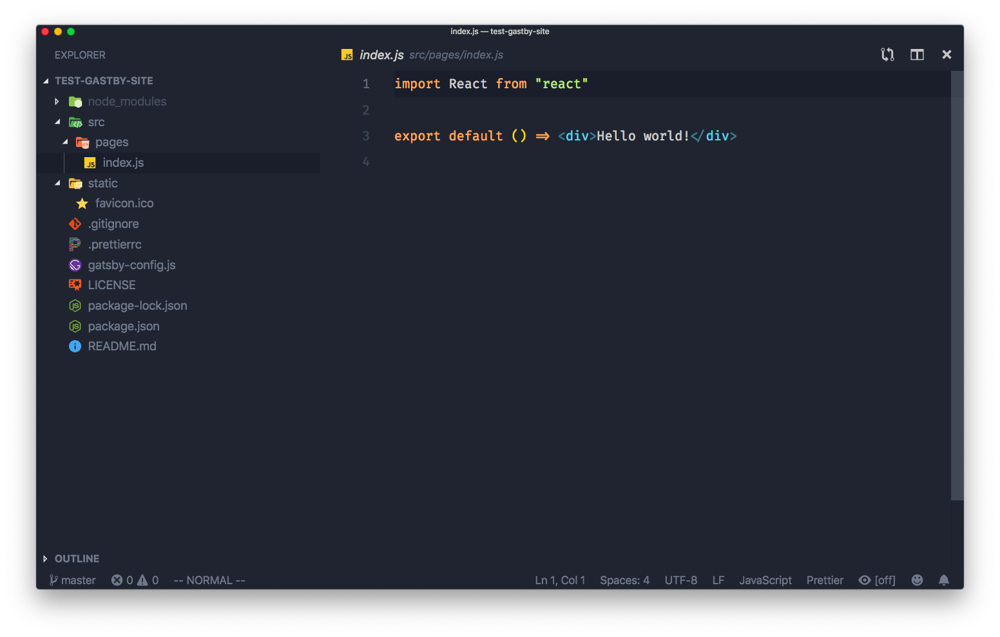
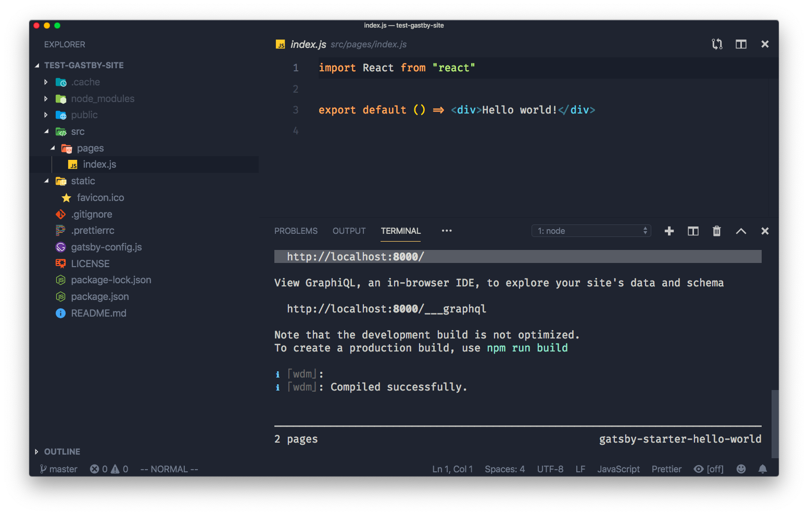
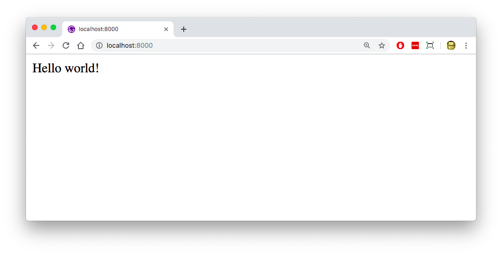
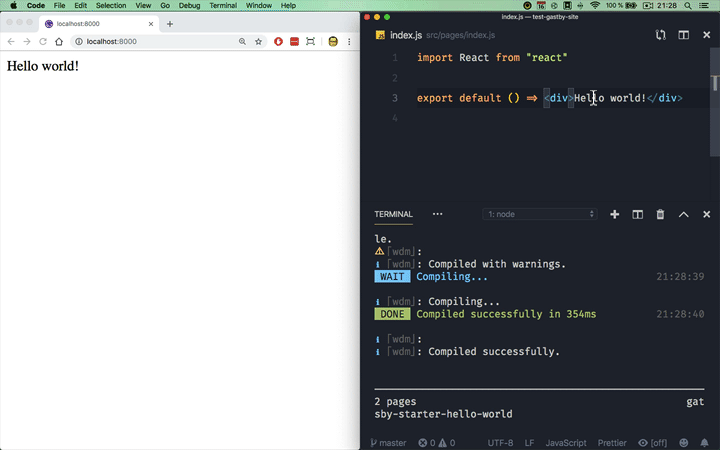

# Creating a personal site with Gatsby and GitHub Pages

If you are a developer and you want to create a personal portfolio site or maintain a blog to keep your learnings, its pretty possible that you'll want to use a static site generator instead of a full fledged Content Management System.

After all, if you use a static site generator, you'll be working directly with code and you might be able to use Markdown and Git to add your content and keep track of your changes. Which maybe you are already doing for your current development efforts.

So here I'll be showing you how to create a personal blog using a [JAM Stack](https://jamstack.org/). And particularly I'll be using [Gatsby.js](https://www.gatsbyjs.org/) for creating just this.

As an added benefit, since the resulting blog will be composed of just static assets, I'll show you how to publish your blog in [Github.IO](https://pages.github.com/) for free.

## Requirements

To create and deploy your blog you'll need

- Basic understanding of [Node.js](https://nodejs.org)
- `node` and `npm` already installed
- A Code Editor. (I'll be using [Visual Studio Code](https://code.visualstudio.com))
- Git command line
- A [Github](https://github.com) account

A basic understanding of [React.js](reactjs.org) is a plus, since _Gatsby_ is based on it. But this is no a dealbreaker.

## So what is Gatsby?

Well, [Gatsby](https://gatsbyjs.org) is a static content generator much like [Jekyll](https://jekyllrb.com/) and [Hugo](https://gohugo.io) but written in JavaScript.

_Static Content Generator_ means that **Gatsby** takes a bunch of files written in languages like PHP, Ruby, ES6, Markdown, etc. And _compiles_ them into HTML and Vanilla Javascript. Which is great, because there is nothing more performant that plain old html.

Gatsby **compiles** your JavaScript _scripts_ and Markdown files into HTML. So you can have **reusable components**, like headers, footers, sidebars, sliders, etc. That can be re-used throughout your site but without the need of a dynamic content management system.

What sets Gatsby apart is that is written in JavaScript and uses using React for its components! This means that your reusable components can (and have to) be React Components.

> Remember, your components are written in React (JSX) but compiled and render on the server.

## Setup Development

I know I said that `node` and `npm` are pre-requisites, but in case you are looking for a quick script on how to install it, here are the step to do it using [Homebrew](https://brew.sh)

```bash
brew update
brew install node git
brew install visual-studio-code
```

If you are using _Visual Studio Code_ like me, you can go ahead and install the plugin [Prettier](https://github.com/prettier/prettier) which is an "opinionated code formatter". This is not a requirement, but it will make your React files much more pretty 😉.

```bash
code --install-extension esbenp.prettier-vscode
```

Now that we have our pre-requisites installed, lets install the Gatsby Command Line or `gatsby-cli`

```bash
npm install -g gatsby-cli
```

The `-g` means that you'll have `gatsby` as a global command line executable. Which is evident by he `gatsby --help` command above.

If it all went well, you'll have everything you need to use Gatsby:



...And that's it. You are ready to rock!.

## Creating our blog project

To start our site we need to execute the command `gatsby` with 2 parameters:

1. The name of you project (or local folder)
2. The template you are going to use as a **starter** for your site

```bash
gatsby new test-gastby-site https://github.com/gatsbyjs/gatsby-starter-hello-world
cd test-gatsby-site
code . # Start visual studio code
```

Here i used `test-gastby-site` as the name of my project and `gatsby-starter-hello-world` as the base template of our project.

There are a lot of [templates or starters](https://www.gatsbyjs.org/starters/?v=2) in the Gatsby homepage which will create a complete site with a lot of styling and starter content. I do not recommend using those, at least not for this project, since there is a lot of code and dependencies that you might not need.

The starter `gatsby-hellow-world` is perfect for a new project for its simplicity and barebones code.



Now, we can start developing... Just type `npm run develop` and open a browser in `http://localhost:8000`

> You can also use the command `gatsby develop`. to start the project, but I recommend using `npm run develop` since that way you can pass environment variables

Notice that Gatsby is printing that the project is available in `localhost:8000`.



Which means that if you open up a browser window on `http://localhost:8000`, you'll get this:



As you can see, our new site has just one page with the content "Hello World!" and without any styling.

Now lets start making changes...

## Modify the Homepage

By default, Gatsby converts any `.js` file in `src/pages/` written in JSX into html pages.

> Markdown conversion will be covered in a future article

...So now you know where that _Hello World!_ comes from.

If you want to modify the homepage of your site, you have to edit `src/pages/index.js`. But before we do that, let me point out one very cool thing about Gatsby...

If you executed `gatsby develop` and then opened a browser in the URL `http://localhost:8000` you have _Live Reload_. Meaning that every time you save a file, your browser will reload by itself picking up the changes.

So lets change `src/pages/index.js` to the following content:

```jsx {7}
import React from "react"

export default () => (
  <div>
    <h1>This is the index page</h1>
    <p>
      
    </p>
  </div>
)
```



## Create a new page

Now that we know how to modify the home page (or `index.js`), lets add a new page to our site.

To create a new page, we just need to create a new `.js` file in `src/pages/` and create a React component.

So create the file `src/pages/contact.js` and add the following code

```jsx
import React from "react"

export default () => (
  <div>
    <h1>Contact Mario</h1>
    <p>Do you have a project that needs a developer</p>
    <p>Just drop me a line and lets talk</p>
  </div>
)
```

If you know React, then the previous code should be familiar to you: We're creating a React Component that outputs some JSX which Gatsby its going to convert to HTML and the push it to the browser.

> This is not a tutorial in React, so if you want to dig deeper in JSX and all things React, you can visit [the React documentation](https://reactjs.org/docs).

The cool thing is that we don't have to import this module into any parent or declare a part of the DOM to render anywhere to display this content. Gatsby takes care of that for us.

## Create a link

Now that we have 2 pages in our site, `index.js` and `contact.js` lets link them.

Here Gatsby also comes to the rescue. It provides us with a `<Link />` component that allows us to link pages without worrying about the final path of the generated HTML.

So just change the `index.js` content to the following

```jsx {2,6}
import React from "react"
import { Link } from "gatsby"

export default () => (
  <div>
    <h1>This is the index page</h1>
    <Link to="/contact">Contact Page</Link>
    <p>
      
    </p>
  </div>
)
```

And the contact page to

```jsx {2,7}
import React from "react"
import { Link } from "gatsby"

export default () => (
  <div>
    <h1>Contact Mario</h1>
    <Link to="/">Homepage</Link>
    <p>Do you have a project that needs a developer</p>
    <p>Just drop me a line and lets talk</p>
  </div>
)
```

Now you have links on each page that point to each other.

## Sub-Components

So far you could say that Gatsby makes things more complicated since you have to write in JSX what you could already write in HTML... An you are right. But that is because we haven't looked at components.

This is one of the things that makes Gatsby a viable (and sometimes better) alternative to CMS's like Wordpress or Drupal: The use of **components**

Components are reusable pieces of code that you can place in multiple pages and that can be changed by the use of parameters. Additionally you can use components inside components, much like inception.


... So the possibilities are endless.

Good candidates to make a component are:

- Your site header
- The main menu
- Your site footer
- Sidebars
- Advertising elements
- Popups
- And many more...

You can place components almost anywhere in the Gatsby project, but the convention is to place them in the folder `src/components` and like pages, this are React components that can be used anywhere.

So lets create our first component. Create the file `src/components/header.js` with the following contents.

```jsx
import React from "react"

export default props => <h1>{props.content}</h1>
```

And that's it, you created your first reusable component in Gatsby. Now lets use it. Change `src/pages/index.js` adding the `<Header />` component.

```js {3,7}
import React from "react"
import { Link } from "gatsby"
import Header from "../components/header"

export default () => (
  <div>
    <Header content="This is the Homepage" />
    <Link to="/contact/">Contact Page</Link>
    <p>
      
    </p>
  </div>
)
```

Now we have the heading of the page as a component.

You can do the same with `contact.js`, but I'll leave that to you.

## Using static assets

Importing static assets like images or PDF files can be done by placing them inside the `src/` directly, and them importing them using the `import` directive much like importing css fies.

Take the contact page p.e. Lets add a local image.

First, lets place an image (any image) in `src/images/profile.jpg` and

```jsx {4,12}
import React from "react"
import { Link } from "gatsby"
import Header from "../components/header"
import Bird from "../images/bird.jpg"

export default () => (
  <div>
    <Header content="This is the contact page" />
    <Link to="/">Homepage</Link>
    <p style={{ color: "red", fontFamily: "sans-serif" }}>
      Do you have a project that needs a developer
    </p>
    <p>Just drop me a line and lets talk</p>
    <div>
      
    </div>
  </div>
)
```

Notice that if you have to specify units, you have to pass the value with quotes, also, the _auto_ value is accepted.

## Inline styling

Styling in Gatsby follows the [React rules](https://reactjs.org/docs/dom-elements.html#style). just add the parameter `style` to the element you want to style.

Take `contact.js`:

```jsx {9}
import React from "react"
import { Link } from "gatsby"
import Header from "../components/header"

export default () => (
  <div>
    <Header content="This is the contact page" />
    <Link to="/">Homepage</Link>
    <p style={{ color: "red", fontFamily: "sans-serif" }}>
      Do you have a project that needs a developer
    </p>
    <p>Just drop me a line and lets talk</p>
  </div>
)
```

In the 9th line we're making the text red and the `font-family` to be `sans-serif`.

If you are new to React, you have to be aware of the following:

- **You are using JSX and not html**. So the `style` property in the `<p>` tag is not an HTML parameter but a JSX property.
- The css parameters are separated by commas
- You have to use the React equivalent of the css directive. P.e. in React `font-family` is `fontFamily`
- Values have to be enclosed by quotes since they are JavaScript parameters
- You have to use double curly braces

## Global Styling

Inline styling works great for small changes, but most of the time you'll be using global styling... the one that uses a CSS file.

To use **global styling** you have to do 2 things:

1. Create a global css file inside `src` (I recommend `src/styles/global.css` as Gatsby's documentation does)
2. You have to tell Gatsby to use that CSS file on all the pages

### 1. Create a global css file

So lets create the file `src/styles/global.css` with the following content:

```css
html {
  background-color: #ccc;
}
```

### 2. Tell Gatsby to use this global file

For this, we have to create a configuration file called `gatsby-browser.js` that should live in the root of our project.

This file tells Gatsby which modules to import for all pages, in our case the css module.

So lets create `gatsby-browser.js` with the following contents:

```jsx
import "./src/styles/global.css"
```

Since this is a configuration change, we have to restart Gatsby... So ctrl-c on the terminal where `gatsby develop` is running and issue again that command:


The cool thing here is that further changes to `global.css` will be picked up by Gatsby and live reload will work as expected.

## Preparing our project for publishing

Ok, now we have a working site with 2 pages and some very ugly styling. ¡Lets publish that for the world to see!

Until now we've been editing and modifying content on _development_ mode. This means that we have our site working as a dynamic page and we still have no static assets. To create our static site, he have to issue Gatsby's `build` command.

```bash
gatsby build
```


This will create the `public/` directory with a bunch of static assets.

All of this files is your **static** site. And are the result of compiling all the JavaScript files that we've been working on. This are the files that finally have to be publish in a way that can be accessed when visiting `https://marioy47.github.co` (or your username in your case).

Since we're working with github-pages, we just can't simply upload them to a server. We have to use git to publish them. And most importantly only files in `public/` should be published in the master branch of our repo. Not so easy ehh.

Thankfully there is an `npm` module named `gh-pages` that is going to help us with that.

## Configure gh-pages

So the `gh-pages` module is going to take care of uploading our files to github using `git` and most important of all, is going to take care of just publishing the files on `public/` to the `master` branch.

so lets install it:

```bash
npm install --save-dev gh-pages
```

**And here is the trick**...

We have to modify the file `package.json` to add a section called `homepage` with the URL of your published site. And we also have to create a script (that we'll called `deploy`) that deploys to github on the master branch. This is accomplished with the following changes on `package.json`

```json {5,8}
{
  ...
  "version": "0.1.0",
  "license": "MIT",
  "homepage": "https://marioy47.github.io",
  "scripts": {
    ...
    "deploy": "gh-pages -d public -b master"
  }
  ...
}
```

Here we're instructing `gh-pastes` to push the `public/` directory to the master branch in github

With this you can just issue the command `npm run deploy` to publish your site.

...But for that to work we have to configure github first.

## Create a new github repo

We have to tell github which of our repositories should be treated as a github page.

The best way to have github publish our site is to create a new repo with the name <username>.github.io (<username> is your github username). So github know what repository is going to be used as a site, and that site be your main site.


In my case, the username was `marioy47` so i created the repo `marioy47.github.io`


Copy the remote address for the repo since we'll be needing it in a few moments.

Now that we've create a new repo, go to your computer and initialize github in it. Then add the remote address of the repo so you can push content to it.

```bash
git init
git checkout -b develop
git add .
git commit -m "First commit"
git remote add origin git@github.com:marioy47/marioy47.github.io.git
git push -u origin develop
```


**A few important things**

1. We committed our project to the `develop` branch and not to master.
2. We pushed to the remote `develop` branch. This is because github-pages requires our static files to be in master

Now your github repo should look like this:


## Deploy to github

Go back to your terminal and deploy your site:

```bash
npm run deploy
```

> This is the new commando we created a couple of steps ago


This will push the contents of the `public/` directory into your repo on the `master` branch


And now you can access your site in http://<username>.github.io


