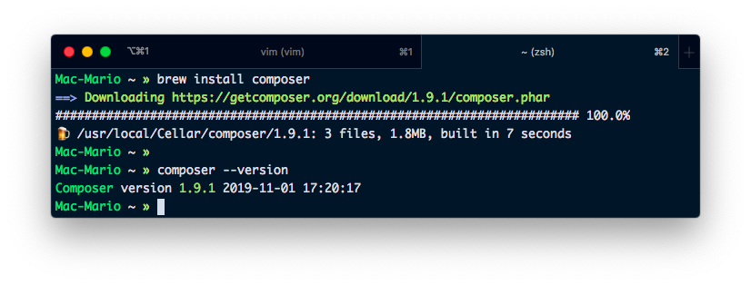
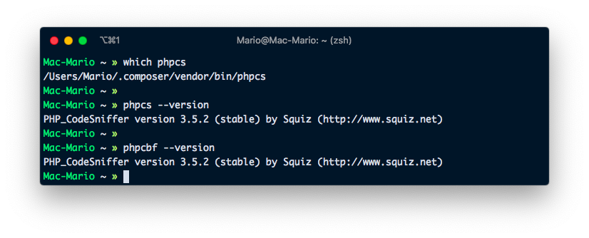
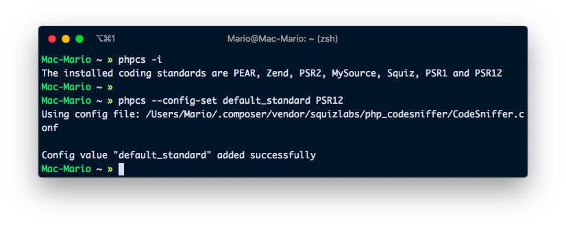
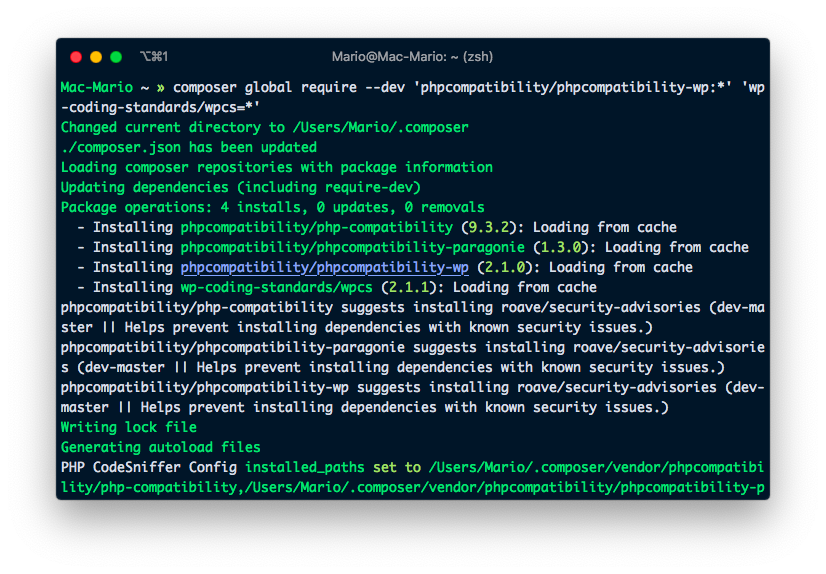

# How to install phpcs Globally and configure Visual Studio Code to use it

So... I'm not going to explain to you what `phpcs` and `phpcbf` are. Instead I'm going to quote the [official github page](https://github.com/squizlabs/PHP_CodeSniffer)

> **PHP_CodeSniffer** is a set of two PHP scripts; the main `phpcs` script that tokenizes PHP, JavaScript and CSS files to detect violations of a defined coding standard, and a second `phpcbf` script to automatically correct coding standard violations. PHP_CodeSniffer is an essential development tool that ensures your code remains clean and consistent.

In my case, when I'm developing WordPress plugins, is a requirement since there are coding standards that are to different to remember.

... Also,

PHP_CodeSniffer has options to detect invalid code or unused variables... So its a complete win if you have it installed.

Here I'm going to show you how to install it globally so you can use is in all your projects. And, as an added bonus, I'm going to teach you how to configure [Visual Studio Code](https://code.visualstudio.com) so it uses it correctly.

## Requirements

For PHP_CodeSniffer to work, you have to install [Composer](https://getcomposer.com) which is the equivalent of [npm](https://npmjs.com) in the javascript world.

If you have MacOs with [brew](https://brew.sh) installed, just open up a terminal and execute

    brew install composer



If you don't have _brew_ then you have to follow the instructions in [composer's download page](https://getcomposer.org/download/):

**ITS VERY IMPORTANT THAT YOU USE THE INSTRUCTIONS ON THE COMPOSER'S DOWNLOAD PAGE!!!**. There you'll se how to configure your `PATH` variable, which is essential for this tutorial to work!!

## Install PHP_CodeSniffer Globally

Now that we have composer, you can install the commands `phpcs` and `phpcbf` so they are available globally.

For that we'll be using our freshly installed composer using the command `install` and the parameter `global`

    composer global require --dev 'squizlabs/php_codesniffer=*'

> Latest instructions here: https://github.com/squizlabs/PHP_CodeSniffer

If it all went well, you should now be able to query phpcs's version and find its path:

In Mac or Linux

    which phpcs

In Windows:

    where.exe phpcs



## Default Coding Standards

To verify which standards PHP_CodeSniffer includes out of the box, you can execute

    phpcs -i

This will show you which standards you have installed until now.

Now, if you use [Laravel](https://laravel.org), [CakePHP](https://cakephp.org), [Symfony](https://symfony.org) or other modern framework you can execute the following command and be done with it:

    phpcs --config-set default_standard PSR12

Here we just asked `phpcs` and `phpcbf` to use the [PSR-12](https://https://www.php-fig.org/psr/psr-12/) coding style which as of this writing is the recommended one on most modern frameworks.



You can jump to the _Visual Studio Configuration_ section if you are not developing for WordPress.

## Install WordPress Coding Standards

Wordpress uses a very particular (and outdated in my opinion) coding standards that require additional configuration.

So execute the following command

```shell
composer require global --dev 'phpcompatibility/phpcompatibility-wp:*' 'wp-coding-standards/wpcs=*'
phpcs -i
```

You'll see that the new standards are installed.



## Visual Studio Configuration

One step that we left out on the last section was to declare Wordpress as the default standards. The reason for that is that since I develop for Laravel as well as Wordpress, I preffer to define which standard to use in visual studio on the [workspace](https://code.visualstudio.com/docs/getstarted/settings#_creating-user-and-workspace-settings) level

So, first install the [PHP Sniffer Extension](https://github.com/wongjn/vscode-php-sniffer) with the command

    code --install-extension wongjn.php-sniffer

Out of the box, the `PHP Sniffer` extension will work with the global `phpcs` that you just installed. But if you are developing for WordPress, I recommend you go to [Automatics Jetpack](https://github.com/Automattic/jetpack/) project and download this 3 files:

- `.phpcs.xml.dist` https://github.com/Automattic/jetpack/blob/master/.phpcs.xml.dist for applying the complete coding standards
- `.editorconfig`: https://github.com/Automattic/jetpack/blob/master/.editorconfig To tell WordPress how to indent and en lines
- `.prettierrc`: https://github.com/Automattic/jetpack/blob/master/.prettierrc used for node development inside WordPress
