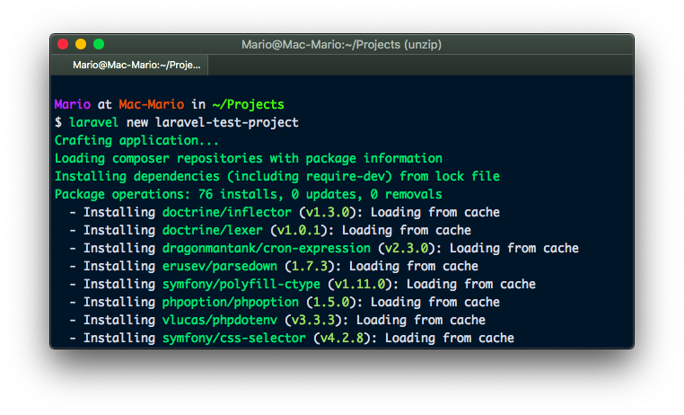
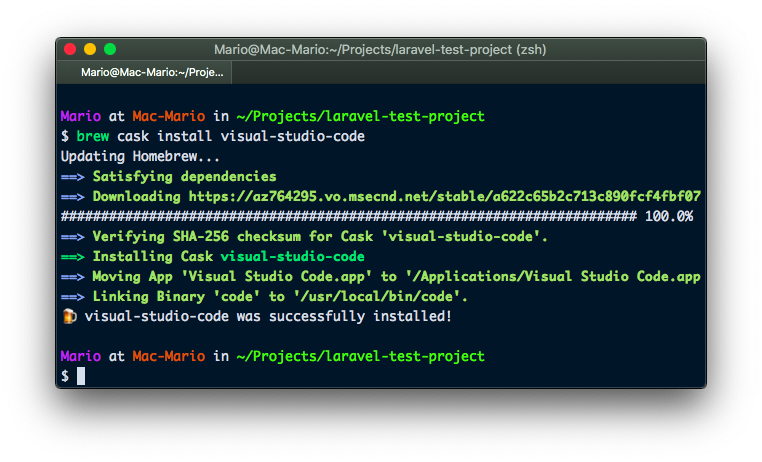
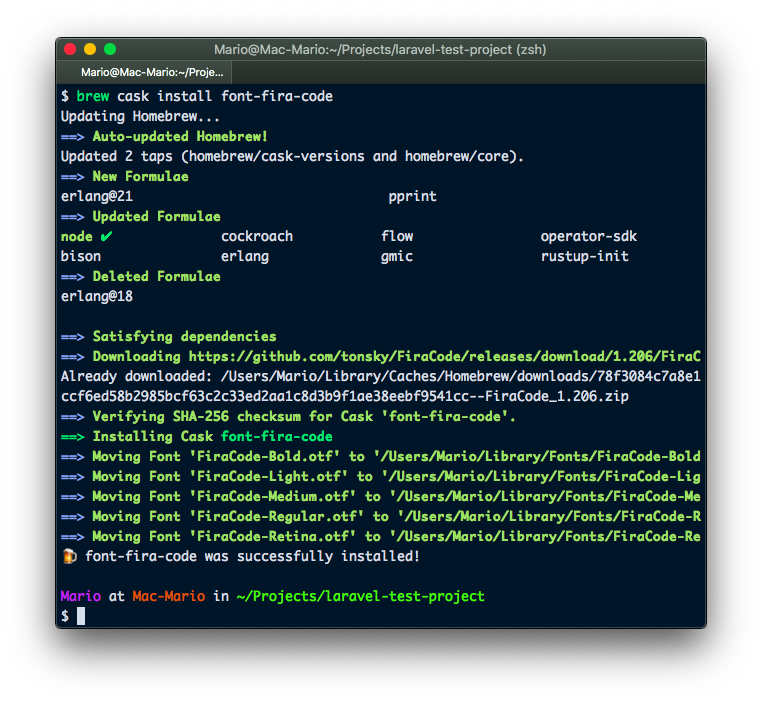
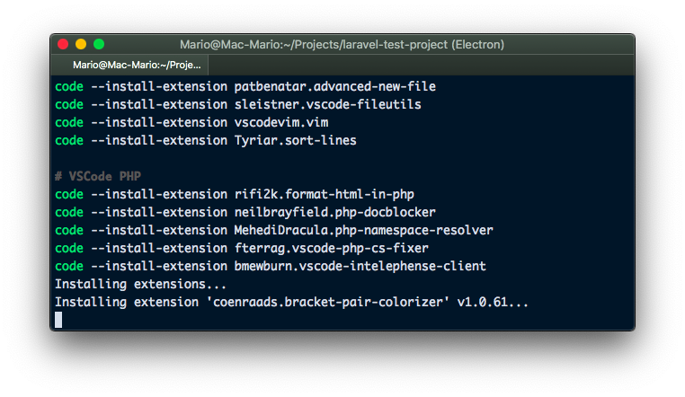
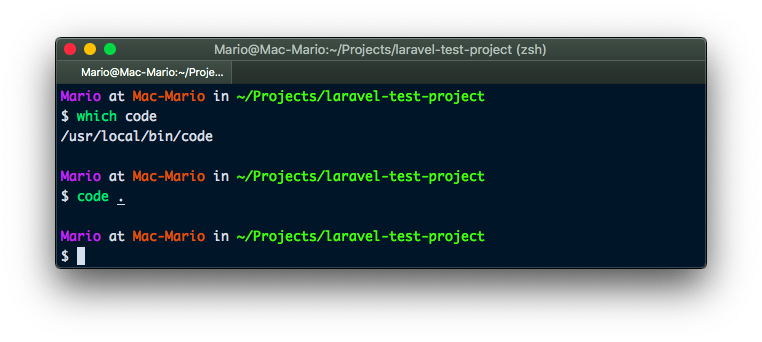
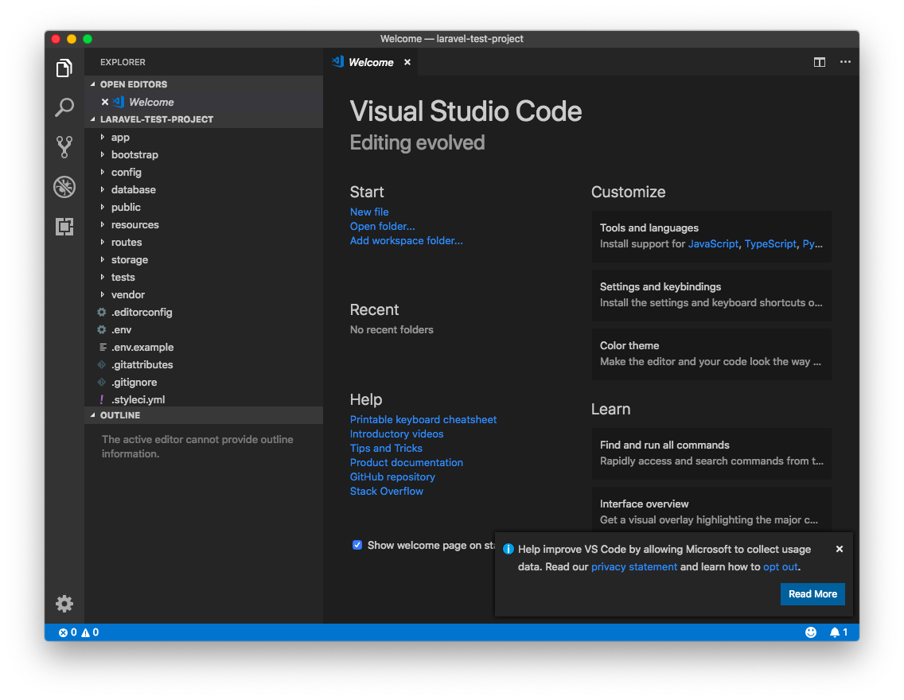
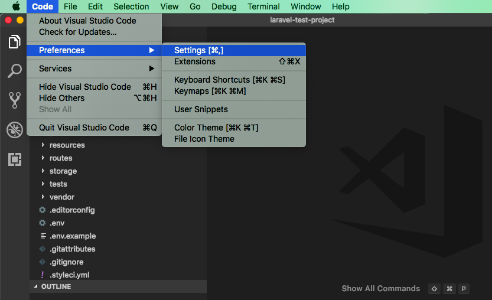
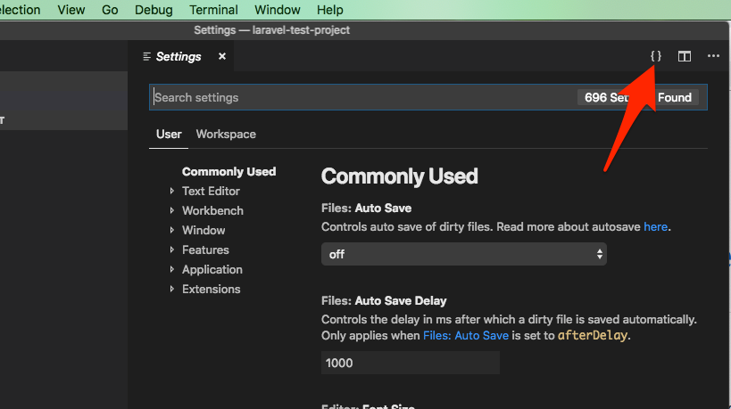
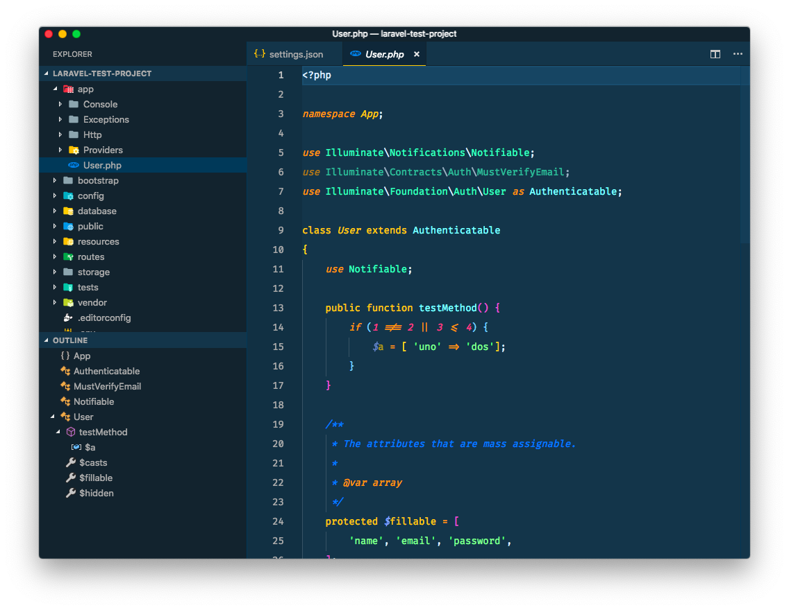
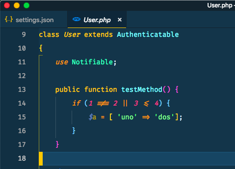

# Configurar Visual Studio Code para desarrollar en PHP

Puedes pensar lo que quieras de Microsoft, pero la verdad es  que últimamente ha tenido una serie de acertos en la forma como se ha aproximado a los desarrolladores:

- Ha permitido correr programas de linux de manera nativa en Windows con WSL
- Abrió el código de su plataforma .Net (ahora es open source)
- Agregó Linux a su oferta de sistemas operativos de Azure
- **Creo un editor de código abierto y extensible llamado Visual Studio Code**

Hasta hace un tiempo pensé que el único editor de PHP que era recomendable era [PhpStorm](https://www.jetbrains.com/phpstorm/), pero la verdad es que _Visual Studio Code_ ha superado mis espectativas y si a esto le agregas que no solo puede ser utilizado para desarrollar PHP sino JavaScript, Dart, Go, Ruby, etc. Que es completamente gratis y que es extendible con extensiones... Hace que sea casi que obligatorio trabajar en el.

Para ser sincero, creo que PhpStorm sigue siendo un editor de PHP superior, pero el precio de _Visual Studio Code_ es insuperable.

Pero no todo es color de rosas... Si quieres usar _Visual Studio Code_ como tu editor principal para desarrollar en PHP, es necesario buscar entre cientos de extensiones cuales son las que en realidad te hacen productivo en PHP. Además de que debes realizar ciertas configuraciones para que el editor responda de la manera adecuada en este tipo de proyectos.

... Es por esto que en este artículo te voy a dar una receta de como configurar este editor para que sea super ágil para trabajar en PHP y tambié una serie de trucos para que tu productividad se dispare.

**Nota Importante**: Este no es un tutorial para principiantes de _Visual Studio Code_ sino un guía rápida de como ser más productivo a la hora de programar en PHP en el.

## Primero... creemos un proyecto en PHP para hacer pruebas
Anque no vamos a desarrollar, si vamos a necesitar un entorno de trabajo donde podamos hacer pruebas y verificar que nuestro nuevo editor responde como en realidad necesitamos.

Así que voy crear un proyecto nuevo de [Laravel](https://laravel.com) para verificar que _Visual Studio (Code)_ si se es capaz de realizar cosas como verificar rutas, encontrar archivos, resolver dependencias, etc.

```bash
laravel new laravel-test-project
cd laravel-test-project
```



Listo, tenemos un nuevo proyecto de laravel en `~/Projects/laravel-test-project`

## Instación de aplicativos y fuentes
Lo puedo decir cien veces: Soy fan de _HomeBrew_

Si no lo conoces, te cuento que [_HomeBrew_](https://brew.sh) (o `brew`) es un aplicativo que corre desde la terminal y te permite **descargar** e **instalar** en un solo paso cientos de posibles aplicaciones para Mac.

Así que si quieres seguir este artículo y estás usando un Mac, te recomiendo que te lo [instales](https://brew.sh) antes de empezar.

Si estás en windows puedes descargar y utilizar los instaladores correspondientes o puedes usar [Chocolatey](https://chocolatey.org/).

Si estás en Linux, la mayoría de las aplicaciones las puedes instalar con tu gestor de paquetes como `apt-get`, `arch`, `yum`, etc.

Habiendo hecho esta aclaración, pasamos a descargar e instalar _VSCode_ usando _HomeBrew_. El comando es:
```bash
brew cask install visual-studio-code
```



Y listo!!! Ya tenemos instalado _Visual Studio Code_.

Aprovechamos que estamos en la terminal e instalamos la fuente que vamos a usar en _Visual Studio Code_ llamada _Fira Code_.

```bash
brew cask install font-fira-code
```



En este punto ya tenemos instalados los dos paquetes de Mac que vamos a necesitar para configurar _Visual Studio Code_. Ahora pasemos a la instlación de extensiones y temas.

## Instalar extensiones y temas
Ahora vamos a instalar algunos paquetes de _Visual Studio Code_ para que este sea más bonito y más eficiente en nuestro trabajo.

Un valor agregado de instalar _Visual Studio Code_ con `brew` es que agrega el comando `code` al [PATH](https://es.m.wikipedia.org/wiki/PATH_(inform%C3%A1tica)) el cual permite arrancar el editor e instalar extensiones directamente desde la terminal.

Entonces sin abandonar nuestra terminal ejecutamos la siguiente lista de comandos:

```bash
# Temas, iconos y colores
code --install-extension CoenraadS.bracket-pair-colorizer
code --install-extension jdinhlife.gruvbox
code --install-extension PKief.material-icon-theme
code --install-extension sdras.night-owl
code --install-extension shobhit01.cobalt2-italic
code --install-extension smlombardi.slime
code --install-extension Serge.vsc-material-theme-italicize

# Para ser más productivos
code --install-extension patbenatar.advanced-new-file
code --install-extension sleistner.vscode-fileutils
code --install-extension Tyriar.sort-lines

# Para que entienda mejor PHP
code --install-extension rifi2k.format-html-in-php
code --install-extension neilbrayfield.php-docblocker
code --install-extension MehediDracula.php-namespace-resolver
code --install-extension ikappas.phpcs
code --install-extension bmewburn.vscode-intelephense-client

########## SOLO SI SABES VIM: ##########
code --install-extension vscodevim.vim
```



Ten en cuenta que el último comando (`code --install-extension vscodevim.vim`) instala la funcionalidad como VIM que aunque es lo mejor que le pudo haber pasado a VSCode, también puede ponerte en aprietos. **Así que solo instalala si sabes usar VIM**

## Primer inicio de _Visual Studio Code_
Como dijimos anteriormente, tenemos a nuestra disposición el comando `code`. Así que lo vamos a ejecutar con el argumento `.` para que abra el directorio actual:



Y aquí ya tenemos _Visual Studio Code_ corriendo y mostrando nuestro proyecto de Laravel (mira el listado de archivo a la izquierda... son los archivos de Laravel).



## Configuración de _VSCode_
_Visual Studio Code_ nos ofrece dos formas de configurarlo:
- Mediante una interfaz gráfica con búsqueda de opciones
- Mediante la edición de un archivo `.json`

Sabiendo que somos desarrolladores, entonces usemos la segunda opción. Así que entra a la configuración



...y luego selecciona la opción **Open Settings (JSON)**



Allí vamos a remplazar lo que hay (que en este momento es solo `{}`) por lo siguiente:

```json
{
    "editor.fontFamily": "'Fira Code', Monaco, Inconsolata, monospace",
    "editor.fontLigatures": true,
    "editor.fontSize": 14,
    "editor.minimap.enabled": false,
    "explorer.openEditors.visible": 0,
    "terminal.integrated.fontSize": 14,
    "vim.easymotion": true,
    "vim.leader": ",",
    "workbench.activityBar.visible": false,
    "workbench.colorTheme": "Cobalt2 Italic",
    "workbench.iconTheme": "material-icon-theme",
    "workbench.startupEditor": "none",
    "workbench.statusBar.visible": false,
    "editor.lineHeight": 28
}
```

Si seguiste todos los pasos, entonces tu _Visual Studio Code_ se debe ver así:



## Explicación por favor !!!
Si, estoy conciente que hasta hora todo ha sido algo enredado. Hemos ejecutado `brew` para instalar un par de binario y luego el comando `code` para instalar otros 16!!!

Pero que es lo que tenemos en realidad.

### Minimalísmo
Personalmente me gustan mis editores de texto lo más sencillos y simples posible, al fin y al cabo lo que require de atención es el código.

Entonces quitamos widgets innecesarios


con estos parámetros

```json
{
    // Quitamos MiniMap
    "editor.minimap.enabled": false,

    // Quitamos la parte de "Editores Abiertos"
    "explorer.openEditors.visible": 0,

    // Quitamos la barra izqierda con íconos o "Activity Bar"
    "workbench.activityBar.visible": false,

    // Hacemos que al arrancar NO muestre la pantalla de "Editing Evolved"
    "workbench.startupEditor": "none", // NO muestre la bienvenida

    // Elimnamos la barra de estado en la parte de abajo
    "workbench.statusBar.visible": false
}
```

### Que se vea más bonito
Luego de hacerlo más limpio, lo vamos a hacermás bonito, para esto instalamos las siguientes extensiones

- CoenraadS.bracket-pair-colorizer : Cambia los colores de los brackets `[]`, los paréntesis `()` y las llaves `{}`
- jdinhlife.gruvbox : Tema con colores "vintage"
- PKief.material-icon-theme : Agrega íconos a la barra de archivos
- sdras.night-owl : Otro tema con colores amigables para los que trabajamos de noche
- shobhit01.cobalt2-italic : Tema de alto contraste sin ser muy brillante
- smlombardi.slime : Otro tema con acentos verdes
- Serge.vsc-material-theme-italicize : Otro tema basado en Material Design

Y agregarmos lo siguiente a la configuración

```json
{
    // Activamos el tema de íconos de la barra de archivos
    "workbench.iconTheme": "material-icon-theme",

    // Activamos el tema Cobalt2 (Tambien puede ser "Night Owl" o "Gruvbox Dark Hard")
    "workbench.colorTheme": "Cobalt2 Italic",

    // Cambiamos la fuente a "Fira Code"
    "editor.fontFamily": "'Fira Code', Menlo, Monaco, 'Courier New', monospace",

    // Activamos las ligaturas de Fira Code
    "editor.fontLigatures": true,

    // Hacemos la fuente más grande
    "editor.fontSize": 14,

    // Y con mas espacio entre líneas
    "editor.lineHeight": 28
}
```

#### La fuente Fira Code
Esta fuente merece una mención especial, puesto que mejora considerablemente la experiencia de edicón. Déjame mostrarte:



Si te fijas en el método `testMethod()` te daras cuenta que las directivas `!==`, `||`, `<=`, `=>` fueron cambiadas por caracteres especiales mucho más agradables y mucho más fáciles de reconocer.

### Productividad en General
Para ser más productivos instalamos las extensiones
- patbenatar.advanced-new-file: Permite crear archivos nuevos desde la barra de comandos
- sleistner.vscode-fileutils: Permite cambiar el nombre o borrar el archivo actual sin tener que usar el mouse
- Tyriar.sort-lines: Organiza alfabéticamente líneas de código (no solo líneas de teto)

### Productividad en PHP
Aquí también instalamos varias extensiones:

- rifi2k.format-html-in-php: Mejora el formato de código HTML que esté dentro de secciones de PHP
- neilbrayfield.php-docblocker: Crea comentarios tipo PHPDoc antes de las funciones
- MehediDracula.php-namespace-resolver: Agrega automáticamente el namespace de una clase con solo digitar el nombre de la clase
- ikappas.phpcs: Formatea el código PHP según la especificación [PSR-2](https://www.php-fig.org/psr/psr-2/)
- bmewburn.vscode-intelephense-client: Convierte tu _Visual Studio Code_ en una máquina de generar PHP

## Flujo de trabajo
Hasta ahora te he dicho que hacer, que instalar y que hace cada una de las instalaciones.

Es hora de orquestrar todo esto para disparar tu productividad.
