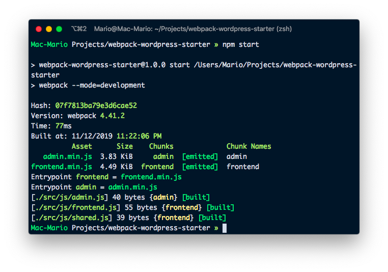
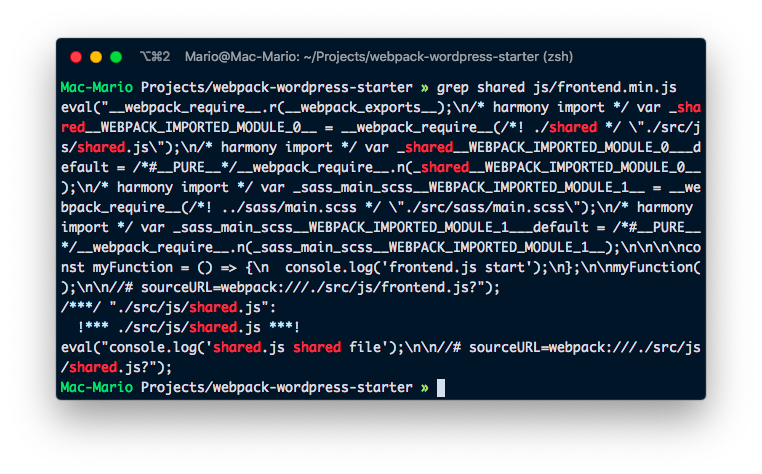

So JavaScriopt is the future of the web, and that's [not just me saying)[https://www.youtube.com/watch?v=KrZx4IY1IgU&feature=emb_title], everybody is saying it.

So I'm going show you how to configure webpack so you can use advanced JavaScript now in your plugins and maybe your themes.

## Installation

```bash
npm init -y
npm install --save-dev webpack webpack-cli
```

Add the _start_ script, remove the _main_ option and make the package private

```json{3,4,6}
// package.json
{
  // ...
  //"main": "index.js", // Comment or remove this line.
  "private": true,
  "scripts": {
    "start": "webpack --mode=development" // Change default script
  }
  // ...
}
```

Now lets run webpack and see if it works:


It doesn't... that's because we are not using standard conventions and we don't have still any file to _pack_

## Starting the configuration

Create a test script in `src/js/frontend.js` with this contents.

```js
// src/js/frontend.js
console.log("frontend.js start");
```

Pretty minimal, but enough for our tests.

Noe, let's crate the basic configuration file `webpack.config.js` in our root directory.

```js
// webpack.config.js
const path = require("path");

module.exports = {
  entry: "./src/js/frontend.js",
  output: {
    filename: "frontend.js",
    path: path.resolve(__dirname, "js")
  }
};
```



Now it works. and in `js/frontend.js` we have "packed" javascript file.

## Specify names

Its pretty common that a WordPress plugin uses 2 javascript files:

- One for frontend scripts
- One for the dashboard o backend.

So lest's start by creating `src/js/admin.js` with some minimal code

```js
// admin.js
console.log("admin.js starting file");
```

With 2 files, we have to change our `webpack.config.js` file so at the end of each build we end up with a `js/fronend.js` file AND and a `js/admin.js` file.

So let's add _naming_ conventions to webpack

```js{6,7,10}
// webpack.config.js
const path = require("path");

module.exports = {
  entry: {
    frontend: "./src/js/frontend.js",
    admin: "./src/js/admin.js"
  },
  output: {
    filename: "[name].min.js",
    path: path.resolve(__dirname, "js")
  }
};
```

And verify that everything works

```bash
npm start
```

## Including files

Add `src/js/shared.js` with the another `cosole.log`

```js
// src/js/shared.js
console.log("shared.js shared file");
```

```js
// src/js/frontend.js
import "./shared";

console.log("frontend.js start");
```

```bash
npm start
```



## Adding babel loader

For converting new js to old js.

```bash
npm install --save-dev babel-loader @babel/core @babel/cli @babel/preset-env
```

```js{4-6}
// frontend.js
import "./shared";

const myFunction = () => {
  console.log("frontend.js start");
};

myFunction();
```

```js
// webpack.config.js
module.exports = {
  // ...
  module: {
    rules: [
      {
        test: /\.js$/,
        use: "babel-loader",
        exclude: "/node_modules/"
      }
    ]
  }
};
```

## SASS

```bash
npm install --save-dev node-sass css-loader sass-loader postcss-loader mini-css-extract-plugin
```

```scss
// src/sass/main.scss
$body-bg: blue;

body {
  background-color: $body-bg;
}
```

```js{3}
// src/js/frontend.js
import "./shared";
import "../sass/main.scss";

const myFunction = () => {
  console.log("frontend.js start");
};

myFunction();
```

```js
// webpack.confi.js
const path = require('path');
const MiniCssExtractPlugin = require('mini-css-extract-plugin');

module.exports = {
  // ...
  module: {
      {
        test: /\.(sa|sc|c)ss$/,
        use: [
          {
            loader: MiniCssExtractPlugin.loader,
            options: {
              hmr: process.env.NODE_ENV == 'development'
            }
          },
          'css-loader',
          'sass-loader' // loading order is inverse
        ]
      }
    ]
  },
  plugins: [
    new MiniCssExtractPlugin({
      filename: '../css/[name].min.css', // Relative to output path.
      chunkFilename: '[id].css',
    })
  ]
}
```

## PostCSS

PostCSS plugins used:

- https://github.com/postcss/postcss-import
- https://github.com/robwierzbowski/node-pixrem
- https://github.com/postcss/autoprefixer
- https://github.com/cssnano/cssnano

```bash
npm install --save-dev postcss-loader postcss-import pixrem autoprefixer cssnano
```

```js{18}
// webpack.config.js
// ...
module.exports = {
  // ...
  module: {
    // ...
      {
        test: /\.(sa|sc|c)ss$/,
        use: [
          {
            loader: MiniCssExtractPlugin.loader,
            options: {
              hmr: process.env.NODE_ENV == 'development'
            }
          },
          'css-loader',
          'postcss-loader',
          'sass-loader' // loading order is inverse
        ]
      }
    ]
  },
  plugins: [
    // ...
  ]
}
```

```json
// package.json
{
  // ...
  "devDependencies": {
    // ...
  },
  "postcss": {
    "map": false,
    "plugins": {
      "cssnano": {},
      "autoprefixer": {},
      "pixrem": {},
      "postcss-import": {}
    }
  }
}
```

## Using images:

```bash
 npm install --save-dev file-loader imagemin-webpack-plugin
```

```js
// webpack.config.js
const path = require("path");
const MiniCssExtractPlugin = require("mini-css-extract-plugin");
const ImageminPlugin = require("imagemin-webpack-plugin").default;

module.exports = {
  // ...
  module: {
    rules: [
      // ...
      {
        test: /\.(png|jpg|gif)$/,
        use: {
          loader: "file-loader",
          options: {
            outputPath: "../images/",
            name: "[name].[ext]"
          }
        }
      }
    ]
  },
  plugins: [
    // ...
    new ImageminPlugin({
      pngquant: {
        quality: "95-100"
      },
      cacheFolder: "./imgcache"
    })
  ]
};
```

```js{4}
// src/js/frontend.js
import "./shared";
import "../sass/main.scss";
import "../images/nathan-dumlao.jpg";

const myFunction = () => {
  console.log("frontend.js start");
};
myFunction();
```

## Develop vs Build

```json
  "scripts": {
    "start": "webpack --mode=development --watch",
    "build": "webpack --mode=production",

  },
```

## Final words

https://github.com/marioy47/webpack-wordpress-starter
