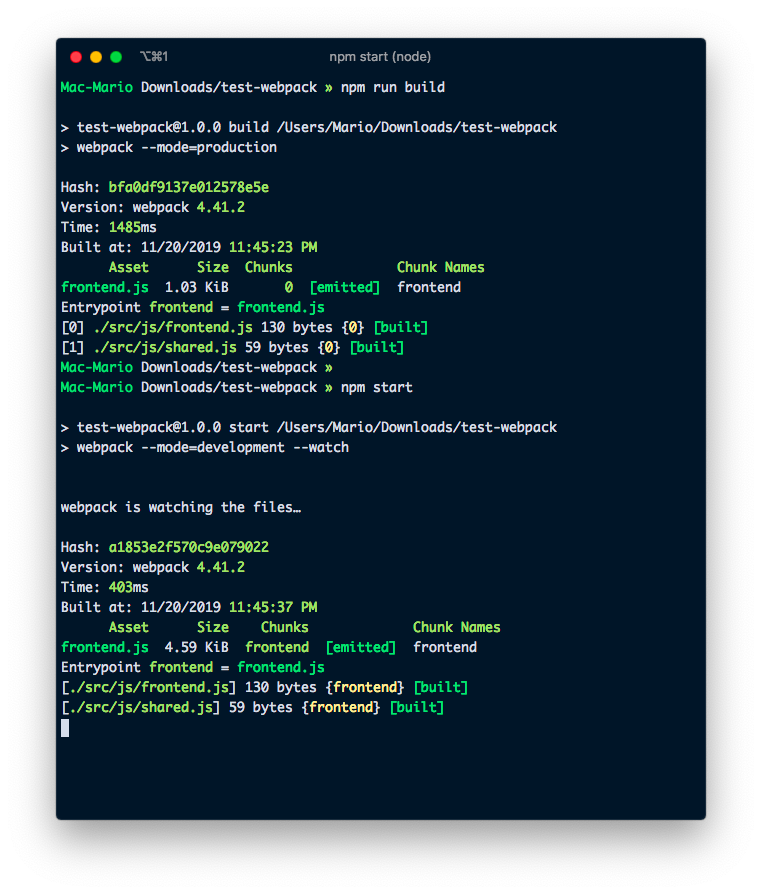
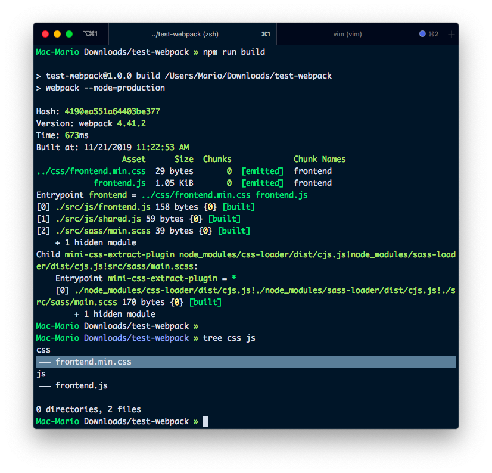

# Using Webpack to compile Javascript in an Wordpress Plugin

So JavaScriopt is the future of the web, and that's [not just me saying][https://www.youtube.com/watch?v=krzx4iy1igu&feature=emb_title], everybody is saying it.

Just look at Guttemberg, the new editor for WordPress... Is completelly written using React which is a JavaScript framework if you didn't knew (how com you did'nt knew????).

So if you want to work on WordPress, you need to use JavaScript... And if you want to work in JavaScript, you have to bundle your assets.

But ¿What is asset bundling you ask?

Is the process of compiling all of your javascript, css and even images in just one javascript file, or bundle, that can be included in your HTML. Or in our case, enqueued in with `add_action('wp_enqueue_script', 'enqueue_function')`.

Some of the advantages of bundling web assets are:

- You'll end up with less files. Just one if you are only using scripts for the front-end.
- You cand _develop_ your JavaScript using multiple files since the bundler takes care of concatenating them.
- You'll catch errors on build time and not at the deployment since the bundler has to parse the files first before joining them toghether.
- You wil have to manage smaller files.

If you want to know more about `webpack` and asset bundling, head over to the [documentation page](https://webpack.js.org/concepts/) and have a quick read.

Now that I've convicend you that asses bundling is the way to go. Lets set up a wordpress project that uses **webpack** for asset bundling.

## Starting your project.

I'm going to assume you already know how to create WordPress plugins. So I'm not going to go over how to do that. Instead I'm going to show you how to start with `webpack`.

So first create a `package.json` file with `npm init -y`. And then add `webpack` to it.

```bash
npm init -y
npm install --save-dev webpack webpack-cli
preset-env
```

If you executed those commands correctly, you should have a file in your directory called `package.json` similar to the following:

```json
// package.json
{
  "name": "test-webpack",
  "version": "1.0.0",
  "description": "",
  "main": "index.js",
  "scripts": {
    "test": "echo \"Error: no test specified\" && exit 1"
  },
  "keywords": [],
  "author": "",
  "license": "ISC",
  "devDependencies": {
    "webpack": "^4.41.2",
    "webpack-cli": "^3.3.10"
  }
}
```

To make our life easier, I'm going to add the **start** script, so I can execute `npm start` and have webpack bundle our scripts.

Lets just edit the _scritps_ section replacing the _test_ script with the following:

```json{8}
// package.json
{
  "name": "test-webpack",
  "version": "1.0.0",
  "description": "",
  "main": "index.js",
  "scripts": {
    "start": "webpack"
  }
  // ...
}
```

And I'll test that to see if it works:


ERORR!!! You didn't tought it was going to be that easy, right?

It doesn't work because we are not using standard conventions and we don't have still any file to pack

## WebPack Configuration

We have to instruct webpack what to bundle, how to bundle it and where to put it. That's why we need to create the `webpack.config.js` file.

> You can use parammeters in the command line to instruct webpack to do all that, but there are so many that is not practical to do it that way.

```js
// webpack.config.js
const path = require("path")

module.exports = {
  entry: "./src/js/frontend.js",
  output: {
    filename: "[name].js",
    path: path.resolve(__dirname, "js"),
  },
}
```

Also, lets create the `src/js/frontend.js` file that we just told `webpack` to look for:

```js
// src/js/frontend.js
const myFunction = () => {
  console.log("frontend.js starting file")
}
myFunction()
```


If you look into `js/main.js` you'll see a javascript file with a bunch of giberish and at the end the `frontend.js starting file` content at the end


Now we have webpack working and correctly and we just created our first pack.

## Bundling assets

So far we just created a file that copies our JS to a new locations and adds a lot of giberish to the top. That's not cool.

That's because we haven't done any actual bundling.

To test bundling, create the file `src/js/shared.js` with the follogin content

```js
// src/js/shared.js
console.log("This is the shared file")
```

And change `src/js/frontend.js` to this:

```js{2}
// src/js/frontend.js
import "./shared"

const myFunction = () => {
  console.log("frontend.js starting file")
}
myFunction()
```


That's bundling baby... Yeah!!!

You can now write your scripts in multiple files and have them be compile in just one.

## Specify names

Maybe you've noticed, but the output file was named `main.js` instead of `frontend.js`. That's because we didn't used names on the entry points.

So lets do that. Lest use the name `frontend` as the entry point. Lest edit `webpack.config.js` and change make some changes:

```js{5-7}
// webpack.config.js
const path = require("path")

module.exports = {
  entry: {
    frontend: "./src/js/frontend.js",
  },
  output: {
    filename: "[name].js",
    path: path.resolve(__dirname, "js"),
  },
}
```

and execute `npm start` again. You shuld have a `js/frontend.js` file now with the code of both `src/js/frontend.js` and `src/js/shared.js`.

## Adding babel

Webpack is powerful, very powerful... It allows you to use **loaders** that allows you to transform your source files even further.

There are loaders for transforming images into _base64_ strings, embedding CSS, traspiling javascript into old format, etc.

The `babel-loader` converts all the `js` files into backards compatible ones before saving the file into the destination folder.

So lets install it with:

```bash
npm install --save-dev babel-loader @babel/core @babel/cli @babel/preset-env
```

Anc change `webpack.config.js` to include a `modules` section and inside that section a `rules` section that will instruct webpack how to handles `.js` files:

```js{12-20}
// webpack.config.js
const path = require("path")

module.exports = {
  entry: {
    frontend: "./src/js/frontend.js",
  },
  output: {
    filename: "[name].js",
    path: path.resolve(__dirname, "js"),
  },
  module: {
    rules: [
      {
        test: /\.js$/,
        exclude: /node_modules/,
        loader: "babel-loader",
      },
    ],
  },
}
```

What I'm doing here is:

- Loking for `js` files with the regular expresions `/\.js$/`
- Excluding the `node_modles` folder
- Pasing those files trough the `babel-loader` so the get converted
- Enjoying 😉

Now the output file, which is `js/frontend.js` will be compiled from ES6 to an version that is more compatible.


Look at that! No arrow function but a regular function.

## Develop vs Build

¿Aren't you anoyed by the warning?

```text
WARNING in configuration
The 'mode' option has not been set, webpack will fallback to 'production' for this value. Set 'mode' option to 'development' or 'production' to enable defaults for each environment.
You can also set it to 'none' to disable any default behavior. Learn more: https://webpack.js.org/configuration/mode/
```

I am.

To get rid of that we have to tell webpack that we are workgin either with _development_ or _production_ mode. And for that we need to change the `package.json` file. Secifically, we need to modify the `start` script to pass the flag `mode` like so.

```json{5}
// package.json
{
  // ...
  "scripts": {
    "start": "webpack --mode=development --watch",
    "build": "webpack --mode=production"
  }
  // ...
}
```



If you look closely, you can see that **development mode freezes in the terminal**.

That's because I configured webpack's development mode to keep watching the files for changes by passing also the `--watch` parammeter. Which means that if you change any file in the `src/js` folder will compile immediatelly!.

¿Isn't that special?... We don't need to keep isuing the `npm start` command all the time. We just now have to create change and webpack will compile them immediatelly.

I also created a new script called `build` without the `--watch` flag to be able to compile our files without blocking the terminal.

## SASS

Enought about JS for now. Lets dig into css and sass bundling. But not only bundling but conversion and generation of CSS from SASS.

As always, it all begins by installing new packages:

```bash
npm install --save-dev node-sass sass-loader css-loader postcss-loader mini-css-extract-plugin
```

Now, lets make a test SASS file in `src/sass/main.scss` with the contents:

```sass
// src/sass/main.scss
$body-bg: blue;

body {
    background-color: $body-bg;
}
```

And include that file in our `src/js/frontend.js` file

```js{3}
// src/js/frontend.js
import "./shared"
import "../sass/main.scss"

const myFunction = () => {
  console.log("frontend.js starting file")
}
myFunction()
```

We also have to instruct webpack to find `.scss` files, convert them to `css` and then save them in the `css/` directory:

```js{20-32,35-40}
// webpack.config.js
const path = require("path")
const MiniCssExtractPlugin = require("mini-css-extract-plugin")

module.exports = {
  entry: {
    frontend: "./src/js/frontend.js",
  },
  output: {
    filename: "[name].js",
    path: path.resolve(__dirname, "js"),
  },
  module: {
    rules: [
      {
        test: /\.js$/,
        exclude: /node_modules/,
        loader: "babel-loader",
      },
      {
        test: /\.(sa|sc|c)ss$/,
        use: [
          {
            loader: MiniCssExtractPlugin.loader,
            options: {
              hmr: process.env.NODE_ENV == "development",
            },
          },
          "css-loader",
          "sass-loader", // loading order is inverse
        ],
      },
    ],
  },
  plugins: [
    new MiniCssExtractPlugin({
      filename: "../css/[name].min.css", // Relative to output path.
      chunkFilename: "[id].css",
    }),
  ],
}
```



## PostCSS

PostCSS plugins used:

- https://github.com/postcss/postcss-import
- https://github.com/robwierzbowski/node-pixrem
- https://github.com/postcss/autoprefixer
- https://github.com/cssnano/cssnano

```bash
npm install --save-dev postcss-loader postcss-import pixrem autoprefixer cssnano
```

```js{18}
// webpack.config.js
// ...
module.exports = {
  // ...
  module: {
    // ...
      {
        test: /\.(sa|sc|c)ss$/,
        use: [
          {
            loader: MiniCssExtractPlugin.loader,
            options: {
              hmr: process.env.NODE_ENV == 'development'
            }
          },
          'css-loader',
          'postcss-loader',
          'sass-loader' // loading order is inverse
        ]
      }
    ]
  },
  plugins: [
    // ...
  ]
}
```

```json
// package.json
{
  // ...
  "devDependencies": {
    // ...
  },
  "postcss": {
    "map": false,
    "plugins": {
      "cssnano": {},
      "autoprefixer": {},
      "pixrem": {},
      "postcss-import": {}
    }
  }
}
```

## Using images:

```bash
npm install --save-dev file-loader imagemin-webpack-plugin
```

```js
// webpack.config.js
const path = require("path")
const MiniCssExtractPlugin = require("mini-css-extract-plugin")
const ImageminPlugin = require("imagemin-webpack-plugin").default

module.exports = {
  // ...
  module: {
    rules: [
      // ...
      {
        test: /\.(png|jpg|gif)$/,
        use: {
          loader: "file-loader",
          options: {
            outputPath: "../images/",
            name: "[name].[ext]",
          },
        },
      },
    ],
  },
  plugins: [
    // ...
    new ImageminPlugin({
      pngquant: {
        quality: "95-100",
      },
      cacheFolder: "./imgcache",
    }),
  ],
}
```

```js{4}
// src/js/frontend.js
import "./shared"
import "../sass/main.scss"
import "../images/nathan-dumlao.jpg"

const myFunction = () => {
  console.log("frontend.js start")
}
myFunction()
```

## Develop vs Build

```json
  "scripts": {
    "start": "webpack --mode=development --watch",
    "build": "webpack --mode=production",

  },
```

## Final words

https://github.com/marioy47/webpack-wordpress-starter
